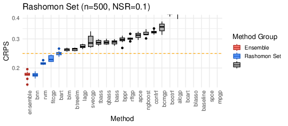

------------------------------------------------------------------------

## Section SM1: R Scripts

Most of the figures in the main paper can be recreated by running the script \url{https://github.com/knrumsey/duqling_results/R/duqling/duqling_paper_main.R}. In addition, the exact implementation for each of the $32$ emulation methods can be found in the `emulators.R` file at \url{https://github.com/knrumsey/duqling_results/R/duqling/emulators.R}. Alternatively the implementation functions can be found using the `duqling` package.

```{R}
#| echo: true
#| eval: true

# Install and load duqling
# devtools::install_github("knrumsey/duqling")
library(duqling)
funcs <- get_emulator_functions("bass")
fit_bass  <- funcs$fit_func
pred_bass <- funcs$pred_func
```

## Section SM2: Summary of Emulator Performance

The package makes it easy to conduct additional analyses. We start by loading the data into the global environment. Then we use the `process_sim_study()` function to get the data frames ready for the duqling functions, which expect an object of class `duq_sim_study`.

```{R}
# Sim study on the 60 test functions
data("sim_study_testfuncs")
duq_testfuncs <- process_sim_study(sim_study_testfuncs)
  

# Sim study on the 40 test functions
data("sim_study_realdata")
duq_realdata <- process_sim_study(sim_study_realdata)
```

### Overall Performance Summary

For each of the 32 surrogate modeling methods, we look at

-   Average runtime

-   CRPS: winrate, top10rate, and average soft-relative scores

-   FVU: winrate, top10rate, and average soft-relative scores

The average soft-relative scores give us a rough measure of practical performance. For emulator $i$ and simulation scenario $j$ we define $$t_{i,j} = \frac{\text{metric}_{i,j} + \epsilon}{\min_i\{\text{metric}_{i,j}\}+ \epsilon},$$ and the average soft-relative score is simply 
$$\text{Soft-Rel-Score}_i = J^{-1}\sum_{j=1}^J\min(t_{i,j}, \text{U})$$
where $\epsilon$ represents a point at which the metric should be considered practically $0$ and $U$ is a truncation point for robustness. 


These metrics can be summarized in `duqling` with the code.
```{R}
#| echo: true
#| eval: false
duq_total <- join_sim_study(duq_testfuncs, duq_realdata)
table <- summarize_sim_study(duq_total,
                  summarize="time", summary_fun = function(val) c(mean=mean(val)),
                  win_rate  = c("CRPS", "FVU"),
                  topK_rate = c("CRPS", "FVU"), K=10,
                  soft_rel  = c("CRPS", "FVU"), 
                  epsilon=c(0.001, 0.001), upper_bound=c(1e4, 1e4))
```

For readability, we have broken this into two tables for CRPS and FVU separately, given below. 
```{R}
#| echo: false
#| eval: true

fmt <- function(x, digits = 3) {
  ifelse(abs(x) < 1e-3 | abs(x) > 1e4,
         formatC(x, format = "e", digits = digits),
         formatC(x, format = "f", digits = digits))
}

duq_total <- join_sim_study(duq_testfuncs, duq_realdata)

# ---- CRPS TABLE ----
table_crps <- summarize_sim_study(
  duq_total,
  summarize = "time", summary_fun = function(val) c(mean = mean(val)),
  win_rate  = "CRPS",
  topK_rate = "CRPS", K = 10,
  soft_rel  = "CRPS", epsilon = 0.001, upper_bound=1e4
)

# Format numeric columns
table_crps$time_mean       <- fmt(table_crps$time_mean)
table_crps$CRPS_winrate    <- fmt(table_crps$CRPS_winrate)
table_crps$CRPS_top10rate  <- fmt(table_crps$CRPS_top10rate)
table_crps$CRPS_softrel    <- fmt(table_crps$CRPS_softrel)

# Rename columns
colnames(table_crps) <- c(
  "Method",
  "Time (mean)",
  "CRPS (win rate)",
  "CRPS (top 10%)",
  "CRPS (soft relative)"
)

knitr::kable(table_crps, align = "lcccc")
```

```{R}
# ---- FVU TABLE ----
table_fvu <- summarize_sim_study(
  duq_total,
  summarize = "time", summary_fun = function(val) c(mean = mean(val)),
  win_rate  = "FVU",
  topK_rate = "FVU", K = 10,
  soft_rel  = "FVU", epsilon = 0.001, upper_bound=1e4
)

# Convert to numeric
for(j in 2:ncol(table_fvu)){
  table_fvu[,j] <- as.numeric(table_fvu[,j])
}

# Format numeric columns
table_fvu$time_mean      <- fmt(table_fvu$time_mean)
table_fvu$FVU_winrate    <- fmt(table_fvu$FVU_winrate)
table_fvu$FVU_top10rate  <- fmt(table_fvu$FVU_top10rate)
table_fvu$FVU_softrel    <- fmt(table_fvu$FVU_softrel)

# Rename columns
colnames(table_fvu) <- c(
  "Method",
  "Time (mean)",
  "FVU (win rate)",
  "FVU (top 10%)",
  "FVU (soft relative)"
)

knitr::kable(table_fvu, align = "lcccc")
```

The reader may be interested in recreating these tables after filtering to a specific set of simulation scenarios, but we omit this here for brevity. 

### Best Emulators for Each Function

To summarize where each emulator performs particularly well, we identify methods that attain the single best CRPS in at least one case. We encourage the reader to filter the simulation study objects before running this code, which we don't do here for the sake of brevity. 

#### Test Functions


```{r}
# Ensure CRPS ranks exist
duq_testfuncs_ranked <- rank_sim_study(duq_testfuncs, metric = "CRPS")

df <- duq_testfuncs_ranked$df

# Keep only winners
best_df <- df[df$CRPS_rank == 1, , drop = FALSE]

# Keep only scenarios with a unique winner
scenario_counts <- ave(best_df$method, best_df$sim_scenario, FUN = length)
best_df <- best_df[scenario_counts == 1, , drop = FALSE]

# Build table: one row per function
ids <- sort(unique(best_df$id))

methods_best <- sapply(ids, function(z) {
  paste(sort(unique(best_df$method[best_df$id == z])), collapse = ", ")
})

n_methods_best <- sapply(ids, function(z) {
  length(unique(best_df$method[best_df$id == z]))
})

total_wins <- sapply(ids, function(z) {
  sum(best_df$id == z)
})

best_table_testfuncs <- data.frame(
  id = ids,
  n_methods_best = n_methods_best,
  methods_best = methods_best,
  stringsAsFactors = FALSE
)

rownames(best_table_testfuncs) <- NULL
colnames(best_table_testfuncs) <- c("Function", "# of Best", "Best Emulators")

knitr::kable(best_table_testfuncs, align = c("l", "c", "l"))
```

#### Real Datasets
Though not shown, the same code is used as above, with `duq_realdata` in place of `duq_testfuncs`. 
```{r}
#| echo: false
#| eval: true

# Ensure CRPS ranks exist
duq_realdata_ranked <- rank_sim_study(duq_realdata, metric = "CRPS")

df <- duq_realdata_ranked$df

# Keep only winners
best_df <- df[df$CRPS_rank == 1, , drop = FALSE]

# Keep only scenarios with a unique winner
scenario_counts <- ave(best_df$method, best_df$sim_scenario, FUN = length)
best_df <- best_df[scenario_counts == 1, , drop = FALSE]

# Build table: one row per function
ids <- sort(unique(best_df$id))

methods_best <- sapply(ids, function(z) {
  paste(sort(unique(best_df$method[best_df$id == z])), collapse = ", ")
})

n_methods_best <- sapply(ids, function(z) {
  length(unique(best_df$method[best_df$id == z]))
})

total_wins <- sapply(ids, function(z) {
  sum(best_df$id == z)
})

best_table_testfuncs <- data.frame(
  id = ids,
  n_methods_best = n_methods_best,
  methods_best = methods_best,
  stringsAsFactors = FALSE
)

rownames(best_table_testfuncs) <- NULL
colnames(best_table_testfuncs) <- c("Function", "# of Best", "Best Emulators")

knitr::kable(best_table_testfuncs, align = c("l", "c", "l"))
```


## Section SM3: Reproducible Simulation Studies

### Seed Transformations

One of the primary design principles of `duqling::run_sim_study()` is reproducibility. For any combination of (i) test function, (ii) $n_{\text{train}}$, (iii) design type, (iv) noise to signal ratio, and (v) replication number, the generated training data (inputs and response) are identical. This is true, even when using slightly different function calls. For example,

```{R}
#| eval: false
results1 <- run_sim_study(fit_func, pred_func,
                          fnames=c("borehole", "ishigami", "banana"),
                          NSR=c(0, 0.1),
                          design_type="LHS",
                          replications=10)

results2 <- run_sim_study(fit_func, pred_func,
                          fnames=c("ishigami", "borehole"),
                          NSR=0,
                          design_type="LHS",
                          replications=c(1, 7, 15))
```

the rows of `results1` and `results2` corresponding to the same simulation scenario will have identical results (with minor exceptions such as timing data) even though they were run in a different order internally.

To accomplish this, we use a rolling polynomial hash (also called Rabin fingerprinting) to generate a unique seed for each simulation scenario, \begin{equation}
    \text{seed} = \left(\sum_{j=0}^6 B^j s_j\right) \bmod M
\end{equation} for prime numbers $B=101$ and $M=100030001$, where the set $\{s_0, \ldots, s_j\}$ describes the simulation scenario. This can be computed safely using Horner's rule (@cormen2022introduction). The $s_j$ values are computed as follows: $s_0$ is the user-defined seed with default $42$ (not usually intended to be modified), $s_1 = n_\text{train}$, $s_2$ is the replication index. To obtain $s_3$, we hash each function name to a unique integer (with high probability) again using the Rabin fingerprint (with $B=31$) after mapping each character to a unique integer. The pair $(s_4,s_5)$ encodes the noise to signal ratio ($NSR$) with at least four decimal places of precision as follows: \begin{equation}
s_4 = \begin{cases}
    99999, & NSR = 0 \\
    \left[-10^4 \times \log(NSR)\right], & NSR < 1 \\
    0, & NSR \geq 1
\end{cases}, \quad\quad\quad
s_5 = \begin{cases}
    0, & NSR < 1 \\
    \left[10^4 \times NSR\right], & NSR \geq 1
\end{cases}.
\end{equation} Finally, $s_6 \in \{1, 2, 3\}$ denotes the design type: $\text{LHS}$, $\text{Grid}$, and $\text{Random}$, respectively.

### The Fallback Model

Even the most robust emulator implementations can occasionally fail, particularly when faced with such a diverse and challenging set of test functions and datasets. To ensure that simulation studies proceed smoothly and results remain well-defined, `duqling::run_sim_study()` incorporates a fallback strategy. If one of the emulator methods fails during fitting or prediction, it is temporarily replaced with a baseline "null model" that predicts by fitting a Gaussian distribution to the marginal of the response variable from the training data (ignoring the inputs). Specifically, the predictive distribution for each test point is a Student’s $t$ distribution with $n-1$ degrees of freedom, mean $\bar{y}$, and variance $S_y^2 (1 + 1/n) (n-1)/(n-3)$, where $n$, $\bar{y}$, and $S^2_y$ are the training set size, mean, and sample variance, respectively. When a failure occurs, it is logged in the `failure_type` column of the returned data-frame one of the following values: "none", "fit", or "pred".

### Simulation Study Output

The `run_sim_study()` function returns an R data frame in which each row corresponds to the outcome of a single simulation scenario, replication, and emulator method. The returned columns include:

-   **method**: Short name of the fitted emulator; if no name is supplied, a unique label (`method<indx>`) is generated automatically.
-   **fname**: The test function name (from `duqling::quack()`).
-   **input_dim**: Input dimension of the test function.
-   **n**: Number of training points used.
-   **NSR**: Noise-to-signal ratio applied in data generation.
-   **design_type**: Experimental design type (`"LHS"`, `"grid"`, or `"random"`).
-   **rep**: Replication index.
-   **t_fit**, **t_pred**, **t_tot**: Elapsed wall-clock time (seconds) for fitting, prediction, and total runtime, respectively.
-   **failure_type**: Categorical indicator for whether the method failed at fitting, prediction, or `"none"` if successful.
-   **RMSE**: Root mean squared error on the test set.
-   **FVU**: Fraction of variance unexplained, computed as RMSE² divided by the total variance.
-   **COVER**<level>, **MIS**<level>: Coverage rates and mean interval scores for each specified confidence level.
-   **IAE_alpha**: Integrated absolute error of empirical coverage across confidence levels, summarizing calibration of predictive intervals.
-   **CRPS**: Mean continuous ranked probability score on the test set, along with summary statistics (`CRPS_min`, `CRPS_Q1`, `CRPS_med`, `CRPS_Q3`, `CRPS_max`) describing the distribution of CRPS across test points.

Additional columns may be present depending on the metrics and simulation options selected by the user. The full results for the simulation studies shown in Section 4 are included in the associated GitHub repository.

### Datasets

A full list of the real datasets used in this comparison is given in the table below. We are hopeful that all of these will be available in `duqling` soon. You can check which emulation datasets are available in duqling via the command:

```{R}
data_quack(raw=FALSE, response_type="uni")
```

A particular dataset can be read into R (internet connection is required) with the command:

```{R}
#| eval: false
emu_data <- get_emulation_data("pbx9501_gold")
X <- emu_data$X
y <- emu_data$y
```

The full list of datasets is given below.

| Dataset                        | n     | p   | In `duqling` | Reference |
|--------------------------------|-------|-----|--------------|-----------|
| plate_deformation              | 138   | 7   | No           | @francom2018sensitivity |
| wind_speed                     | 200   | 17  | No           |           |
| strontium_plume_p4b            | 300   | 20  | Yes          | @volkova2008global |
| strontium_plume_p104           | 300   | 20  | Yes          | @volkova2008global |
| spectra1                       | 500   | 4   | No           | @klein_2020_4069493 |
| spectra2                       | 500   | 4   | No           | @klein_2020_4069493 |
| pbx9501_gold                   | 500   | 6   | Yes          | @rumsey2025coactive |
| pbx9501_ss304                  | 500   | 6   | Yes          | @rumsey2025coactive |
| pbx9501_nickel                 | 500   | 6   | Yes          | @rumsey2025coactive |
| pbx9501_uranium                | 500   | 6   | Yes          | @rumsey2025coactive |
| ptw1                           | 500   | 10  | No           | @preston2003model   |
| discoflux_flyer                | 914   | 6   | No           | @francom2020simulation |
| taylor_foot                    | 962   | 11  | No           |           |
| taylor_length                  | 962   | 11  | No           |           |
| jc                             | 1000  | 5   | No           | @johnson1983constitutive |
| flyerPTW1                      | 1000  | 11  | No           |           |
| flyerPTW2                      | 1000  | 11  | No           |           |
| flyer_plate104                 | 1000  | 11  | Yes          |           |
| diffusion_1D                   | 1000  | 62  | No           | @hlobilova2024diffusion2d |
| fair_climate_ssp1-2.6_year2200 | 1001  | 45  | Yes          | @smith2018fair           |
| fair_climate_ssp2-4.5_year2200 | 1001  | 45  | Yes          | @smith2018fair          |
| fair_climate_ssp3-7.0_year2200 | 1001  | 45  | Yes          | @smith2018fair          |
| taylor_cylinder1               | 1438  | 8   | No           |           |
| stochastic_sir                 | 2000  | 4   | Yes          | @rumsey2024generalized  |
| diffusion_2D                   | 2000  | 53  | No           | @hlobilova2024diffusion2d |
| acme_climate                   | 2980  | 66  | No           |           |
| ptw2                           | 3701  | 13  | No           | @preston2003model   |
| SLOSH_low                      | 4000  | 5   | Yes          | @hutchings2023comparing |
| SLOSH_mid                      | 4000  | 5   | Yes          | @hutchings2023comparing |
| SLOSH_high                     | 4000  | 5   | Yes          | @hutchings2023comparing |
| Z_machine_max_vel1             | 5000  | 6   | Yes          | @brown2018estimating |
| Z_machine_max_vel2             | 5000  | 6   | Yes          | @brown2018estimating |
| Z_machine_max_vel_all          | 5000  | 30  | Yes          | @brown2018estimating |
| e3sm_mnar                      | 9122  | 2   | Yes          | @grosskopf2021situ  |
| nuclear_data                   | 9307  | 178 | No           | @francom2019nuclear |
| e3sm_mcar                      | 10000 | 2   | Yes          | @grosskopf2021situ  |
| icf1                           | 10000 | 5   | No           |           |
| icf2                           | 10000 | 5   | No           |           |
| diablo_canyon_plume            | 18000 | 13  | No           | @francom2019calibration |
| okc_plume                      | 22229 | 5   | No           | @brown2009evaluation |


### Test Functions (and Characteristics)

The `duqling` library of test functions is ever growing, but the list of the $60$ test functions studied in this paper can be found as

```{R}
#| eval: false
get_paper_funcs()
```

For these $60$ functions, we computed several characteristics of interest. Future work could try to link these characteristics (or others not listed here) to emulator performance. Determining, in advance, which surrogate modeling technique is likely to succeed on a given computer model would be of great use to practitioners.

| fname                   | input_dim | Rsquared | MoransI | Sobolev |
|-------------------------|-----------|----------|---------|---------|
| const_fn                | 1         | 0.000    | 0.020   | 1.000   |
| forrester1_low_fidelity | 1         | 0.407    | 0.998   | 9.785   |
| forrester1              | 1         | 0.043    | 0.982   | 11.682  |
| grlee1                  | 1         | 0.604    | 0.987   | 16.676  |
| banana                  | 2         | 0.035    | 0.955   | 11.017  |
| dms_additive            | 2         | 0.058    | 0.984   | 9.895   |
| dms_complicated         | 2         | 0.192    | 0.962   | 9.831   |
| dms_harmonic            | 2         | 0.030    | 0.932   | 13.037  |
| dms_radial              | 2         | 0.000    | 0.983   | 7.092   |
| dms_simple              | 2         | 0.189    | 0.948   | 4.768   |
| foursquare              | 2         | 0.471    | 0.931   | 24.490  |
| grlee2                  | 2         | 0.022    | 0.904   | 16.179  |
| lim_non_polynomial      | 2         | 0.643    | 0.974   | 5.532   |
| lim_polynomial          | 2         | 0.594    | 0.958   | 6.212   |
| multivalley             | 2         | 0.091    | 0.701   | 72.760  |
| ripples                 | 2         | 0.003    | 0.807   | 40.944  |
| simple_poly             | 2         | 0.945    | 0.980   | 3.798   |
| squiggle                | 2         | 0.015    | 0.868   | 25.773  |
| star2                   | 2         | 0.204    | 0.803   | 22.482  |
| twin_galaxies           | 2         | 0.442    | 0.962   | 9.100   |
| const_fn3               | 3         | 0.000    | -0.022  | 1.000   |
| cube3_rotate            | 3         | 0.198    | 0.797   | 10.383  |
| cube3                   | 3         | 0.060    | 0.795   | 31.274  |
| detpep_curve            | 3         | 0.795    | 0.956   | 4.611   |
| Gfunction               | 3         | 0.000    | 0.883   | 1.000   |
| ishigami                | 3         | 0.199    | 0.841   | 11.257  |
| rabbits                 | 3         | 0.927    | 0.954   | 4.710   |
| sharkfin                | 3         | 0.246    | 0.753   | 41.910  |
| park4_low_fidelity      | 4         | 0.956    | 0.936   | 3.658   |
| park4                   | 4         | 0.955    | 0.919   | 3.655   |
| pollutant_uni           | 4         | 0.827    | 0.886   | 5.231   |
| cube5                   | 5         | 0.622    | 0.785   | 19.961  |
| friedman                | 5         | 0.770    | 0.877   | 4.856   |
| short_column            | 5         | 0.769    | 0.824   | 4.730   |
| cantilever_D            | 6         | 0.501    | 0.701   | 5.993   |
| cantilever_S            | 6         | 0.699    | 0.827   | 4.495   |
| circuit                 | 6         | 0.973    | 0.855   | 3.869   |
| Gfunction6              | 6         | 0.002    | 0.562   | 1.000   |
| grlee6                  | 6         | 0.302    | 0.433   | 40.708  |
| crater                  | 7         | 0.647    | 0.758   | 5.090   |
| gamma_mix               | 7         | 0.094    | 0.091   | 16.440  |
| piston                  | 7         | 0.914    | 0.819   | 4.093   |
| borehole_low_fidelity   | 8         | 0.947    | 0.786   | 3.766   |
| borehole                | 8         | 0.947    | 0.791   | 3.729   |
| detpep8                 | 8         | 0.802    | 0.752   | 4.609   |
| ebola                   | 8         | 0.856    | 0.748   | 4.794   |
| robot                   | 8         | 0.174    | 0.410   | 8.614   |
| steel_column            | 9         | 0.968    | 0.762   | 3.813   |
| sulfur                  | 9         | 0.549    | 0.698   | 4.473   |
| friedman10              | 10        | 0.742    | 0.674   | 5.064   |
| ignition                | 10        | 0.815    | 0.729   | 3.937   |
| wingweight              | 10        | 0.984    | 0.758   | 3.652   |
| Gfunction12             | 12        | 0.002    | 0.275   | 1.000   |
| const_fn15              | 15        | 0.001    | 0.001   | 1.000   |
| oo15                    | 15        | 0.258    | 0.574   | 1.000   |
| permdb                  | 16        | 0.000    | 0.101   | 46.941  |
| Gfunction18             | 18        | 0.000    | 0.139   | 1.000   |
| friedman20              | 20        | 0.753    | 0.675   | 4.961   |
| welch20                 | 20        | 0.598    | 0.598   | 6.375   |
| onehundred              | 100       | 0.884    | 0.279   | 4.361   |

## Section SM4: The Rashomon Effect and Ensembling

We have already seen that searching for a single emulator that performs best across all functions is a fruitless endeavor—but perhaps we should not even be focused on finding the best emulator for a single setting. *“Amazing things come from having many good models”* is the sentiment behind the Rashomon effect, an idea that has gained increasing attention in recent years (@fisher2019all; @xin2022exploring; @rudin2024amazing; @visokay2025you). The term was originally coined by Leo Breiman to describe the phenomenon in which multiple distinct models explain the data equally well, yet may lead to different conclusions (@breiman2001statistical). While the Rashomon effect is often discussed in the context of noisy or over-parameterized models, we believe it also holds valuable lessons for uncertainty quantification.

Suppose that for a given dataset, we retain all emulators with a CRPS below 0.25 (see Figure below). If we then perform a sensitivity analysis using each of these similarly accurate emulators and they all agree, this serves as a strong sanity check—not just for the conclusions, but also for the models themselves. On the other hand, if the emulators disagree, this immediately signals a need for deeper inspection. For example, imagine that one emulator identifies `x1` as the most important input, `x2` as moderately important, and `x3` as inert—while another emulator ranks `x3` highest, de-emphasizes `x1`, and again sees `x2` as moderately important. Such a discrepancy suggests a lack of identifiability between `x1` and `x3`, and highlights how choosing a single emulator might obscure meaningful structure in the data. Had we selected only one model, we might have confidently reported that `x1` does not matter—when in fact, the full Rashomon set tells a more nuanced story.

{width="100%"}

## Section SM5: Additional Figures and Analysis

In this section, we illustrate how the `duqling` framework can be used to explore additional metrics and visualizations beyond those presented in the main text. See Section SM1 and SM2 for details on installing/loading `duqling` and the simulation study objects. 

We commonly *filter* the simulation study objects to study specific settings, e.g.,

```{R}
#| eval: false
filter_sim_study(duq_testfuncs, n_train=500, NSR=0)
```

The plotting and analysis functions provided by the package include

-   `summarize_sim_study()`: Computes summary statistics across simulation scenarios (e.g., mean or median performance), producing a compact view of emulator performance.

-   `heatmap_sim_study()`: Visualizes performance metrics (e.g., CRPS, FVU) across scenarios using heatmaps, helping identify patterns across settings.

-   `rankplot_sim_study()`: Displays cumulative rank distributions, showing how often each emulator achieves a given rank or better.

-   `paretoplot_sim_study()`: Plots trade-offs between metrics (typically accuracy vs. compute time), highlighting Pareto-efficient methods.

-   `perfprofile_sim_study()`: Generates performance profile plots, showing the proportion of scenarios for which each method is within a factor of the best.

-   `boxplots_sim_study()`: Produces boxplots of performance metrics across scenarios, useful for assessing variability and the Rashomon effect.

-   `rank_sim_study()`: Computes rank-based summaries for a specified metric and appends corresponding rank columns.

-   `normalize_sim_study()`: Normalizes metrics (e.g., scaling relative to variance or baseline values) to improve comparability across scenarios.

-   `relativize_sim_study()`: Computes relative performance metrics by comparing each method to the best-performing method within each scenario.

-   `collapse_sim_study()`: Aggregates results across replications or folds, producing a reduced data frame suitable for summary analyses.

### Fraction of Variance Unexplained

In the main paper, we generally analyze CRPS due to our focus on uncertainty quantification. If the focus is on pure predictive performance and not on well-calibrated predictive intervals, then mean squared error (MSE) or root MSE (RMSE) is the usual choice. The fraction of variance unexplained (FVU) is simply a scaled version of MSE which improves interpretability and allows for some level of comparison between simulation scenarios. We calculate FVU as

$$
\text{FVU} = \frac{\frac{1}{n_{\text{test}}}\sum_{i=1}^{n_{\text{test}}} (y_{\text{test},i} - \hat y_i)^2}{\frac{1}{n_{\text{test}} - 1}\sum_{i=1}^{n_{\text{test}}} (y_{\text{test},i} - \bar{y}_{\text{test}})^2}
$$

where $\hat y_1, \ldots, \hat y_{n_\text{test}}$ are the emulator predictions. This metric (along with RMSE) is automatically calculated during `run_sim_study()` and `run_sim_study_data()`.

#### FVU Rankplots

We use the following loop structure to iterate over the five synthetic simulation settings.

```{R fvurank, fig.width=10, fig.height=6}
n_train_vec <- c(500, 500, 1000, 1000, 5000)
NSR_vec     <- c(0, 0.1, 0, 0.1, 0)
for(i in 1:5){
  title <- paste0("FVU Rank (n=", n_train_vec[i], ", NSR=", NSR_vec[i], ")")
  tmp <- filter_sim_study(duq_testfuncs, 
                          n_train = n_train_vec[i], NSR = NSR_vec[i])
  p <- rankplot_sim_study(tmp, metric="FVU", title=title)
  
  # Adjust sizing
  p <- p + ggplot2::theme_minimal(base_size=12)
  plot(p)
}
```

```{R fig.width=10, fig.height=6}
# Small data
title <- paste0("FVU Rank (Small Data)")
tmp <- filter_sim_study(duq_realdata, 
                        expr = n_train <= 1500)
p <- rankplot_sim_study(tmp, metric="FVU", title=title)
p <- p + ggplot2::theme_minimal(base_size=12)
plot(p)

# Large data
title <- paste0("FVU Rank (Big Data)")
tmp <- filter_sim_study(duq_realdata, 
                        expr = n_train > 1500)
p <- rankplot_sim_study(tmp, metric="FVU", title=title)
p <- p + ggplot2::theme_minimal(base_size=12)
plot(p)
```

#### FVU Performance Profiles

Performance profiles come from the literature on benchmarking for optimization research (@dolan2002benchmarking; @more2009benchmarking). For emulator $i$ and simulation scenario $j$ we define $$t_{i,j} = \frac{\text{metric}_{i,j} + \epsilon}{\min_i\{\text{metric}_{i,j}\}+ \epsilon},$$ and we define $$\rho_i(\tau) = \frac{1}{J}\sum_{j=1}^J1(t_{i,j} \leq \tau).$$ When $\epsilon=0$, the idea is that $\rho_i(\tau)$ tells us the proportion of the time that emulator $i$ is within a factor $\tau$ of the best performing emulator across the $J$ different simulation scenarios. We use a small value of $\epsilon=0.001$ to perform a type of "Laplace smoothing", which effectively induces the belief that values of the metric (FVU, here) less than this value are all effectively equally good.

```{R fig.width=10, fig.height=6}
n_train_vec <- c(500, 500, 1000, 1000, 5000)
NSR_vec     <- c(0, 0.1, 0, 0.1, 0)
for(i in 1:5){
  title <- paste0("FVU Profile (n=", n_train_vec[i], ", NSR=", NSR_vec[i], ")")
  tmp <- filter_sim_study(duq_testfuncs, 
                          n_train = n_train_vec[i], NSR = NSR_vec[i])
p <- perfprofile_sim_study(tmp, metric="FVU", 
                           relative_epsilon = 0.001, tau_lim=c(1, 10000),
                           title=title, color_scale = "viridis")
  
  # Adjust sizing
  p <- p + ggplot2::theme_minimal(base_size=12)
  plot(p)
}
```

```{R fig.width=10, fig.height=6}
# Small data
title <- paste0("FVU Profile (Small Data)")
tmp <- filter_sim_study(duq_realdata, 
                        expr = n_train <= 1500)
p <- perfprofile_sim_study(tmp, metric="FVU", 
                           relative_epsilon = 0.001, tau_lim=c(1, 10000),
                           title=title, color_scale = "viridis")
p <- p + ggplot2::theme_minimal(base_size=12)
plot(p)

# Large data
title <- paste0("FVU Profile (Big Data)")
tmp <- filter_sim_study(duq_realdata, 
                        expr = n_train > 1500)
p <- perfprofile_sim_study(tmp, metric="FVU", 
                           relative_epsilon = 0.001, tau_lim=c(1, 10000),
                           title=title, color_scale = "viridis")
p <- p + ggplot2::theme_minimal(base_size=12)
plot(p)
```

#### FVU Heatmaps

We use a custom colorbar scale to make the figures more readable.

```{R fig.width=10, fig.height=12}
custom <- function(xx){
  log10(pmin(1, pmax(0.001, xx)))
}

n_train_vec <- c(500, 500, 1000, 1000, 5000)
NSR_vec     <- c(0, 0.1, 0, 0.1, 0)
for(i in 1:5){
  title <- paste0("Average FVU (n=", n_train_vec[i], ", NSR=", NSR_vec[i], ")")
  tmp <- filter_sim_study(duq_testfuncs, 
                          n_train = n_train_vec[i], NSR = NSR_vec[i])
  p <- heatmap_sim_study(tmp, metric="FVU", y_scale_fun = custom,
                    colorbar_labels = list(breaks=log10(c(0.001, 0.01,  0.1, 0.56, 1)),
                                           labels=c("<0.001","0.01", "0.1", "0.56", "")),
                    color_scale="mako",
                    title=title)
  
  # Adjust sizing
  p <- p + ggplot2::theme_minimal(base_size=12) +
  ggplot2::theme(
    axis.text.x = ggplot2::element_text(
      angle = 90,
      vjust = 0.5,
      hjust = 1
    ))
  plot(p)
}
```

```{R fig.width=10, fig.height=6}
# Small data
title <- paste0("Average FVU (Small Data)")
tmp <- filter_sim_study(duq_realdata, 
                        expr = n_train <= 1500)
p <- heatmap_sim_study(tmp, metric="FVU", y_scale_fun = custom,
                  colorbar_labels = list(breaks=log10(c(0.001, 0.01,  0.1, 0.56, 1)),
                                         labels=c("<0.001","0.01", "0.1", "0.56", "")),
                  color_scale="mako",
                  title=title)
p <- p + ggplot2::theme_minimal(base_size=12) +
  ggplot2::theme(
    axis.text.x = ggplot2::element_text(
      angle = 90,
      vjust = 0.5,
      hjust = 1
    ))
plot(p)

# Large data
title <- paste0("Average FVU (Big Data)")
tmp <- filter_sim_study(duq_realdata, 
                        expr = n_train > 1500)
p <- heatmap_sim_study(tmp, metric="FVU", y_scale_fun = custom,
                  colorbar_labels = list(breaks=log10(c(0.001, 0.01,  0.1, 0.56, 1)),
                                         labels=c("<0.001","0.01", "0.1", "0.56", "")),
                  color_scale="mako",
                  title=title)
p <- p + ggplot2::theme_minimal(base_size=12) +
  ggplot2::theme(
    axis.text.x = ggplot2::element_text(
      angle = 90,
      vjust = 0.5,
      hjust = 1
    ))
plot(p)
```

#### FVU Boxplots

Boxplots are a great way to summarize a specific simulation scenario. There are thousands of possible boxplots one could make from this data, here's an example.

```{R fig.width=10, fig.height=5}
tmp <- filter_sim_study(duq_testfuncs, id = "welch20", 
                        n_train=500, NSR=0.1)
boxplots_sim_study(tmp, metric="FVU", 
                   ylim=c(0, 1), title="FVU for welch20 (n=5000)")
```

### Continuous Ranked Probability Scores

Continuous ranked probability scores (CRPS) was the primary metric used in the main manuscript, and so we won't rehash all of that here. Here we show some key figures not given in the main manuscript: (i) CRPS rankplots for the real datasets and (ii) CRPS performance profiles for the test functions.

#### CRPS Rankplots (data only)

```{R fig.width=10, fig.height=6}
# Small data
title <- paste0("CRPS Rank (Small Data)")
tmp <- filter_sim_study(duq_realdata, 
                        expr = n_train <= 1500)
p <- rankplot_sim_study(tmp, metric="CRPS", title=title)
p <- p + ggplot2::theme_minimal(base_size=12)
plot(p)

# Large data
title <- paste0("CRPS Rank (Big Data)")
tmp <- filter_sim_study(duq_realdata, 
                        expr = n_train > 1500)
p <- rankplot_sim_study(tmp, metric="CRPS", title=title)
p <- p + ggplot2::theme_minimal(base_size=12)
plot(p)
```

#### CRPS Performance Profiles (testfuncs only)

```{R fig.width=10, fig.height=6}
n_train_vec <- c(500, 500, 1000, 1000, 5000)
NSR_vec     <- c(0, 0.1, 0, 0.1, 0)
for(i in 1:5){
  title <- paste0("CRPS Profile (n=", n_train_vec[i], ", NSR=", NSR_vec[i], ")")
  tmp <- filter_sim_study(duq_testfuncs, 
                          n_train = n_train_vec[i], NSR = NSR_vec[i])
p <- perfprofile_sim_study(tmp, metric="CRPS", 
                           relative_epsilon = 0.001, tau_lim=c(1, 10000),
                           title=title, color_scale = "viridis")
  
  # Adjust sizing
  p <- p + ggplot2::theme_minimal(base_size=12)
  plot(p)
}
```

### Computation Time

The `duqling` package usually times both training and prediction splits, but for this paper we report just the total computation time, because several of the surrogate modeling implementations cannot be split easily.

#### Time Performance Profiles

```{R fig.width=10, fig.height=6}
# Synthetic test functions (5 cases)
n_train_vec <- c(500, 500, 1000, 1000, 5000)
NSR_vec     <- c(0, 0.1, 0, 0.1, 0)

for(i in 1:5){
  title <- paste0("Time Profile (n=", n_train_vec[i], ", NSR=", NSR_vec[i], ")")
  tmp <- filter_sim_study(duq_testfuncs, 
                          n_train = n_train_vec[i], NSR = NSR_vec[i])
  p <- perfprofile_sim_study(tmp, metric="time", 
                             title=title, color_scale = "viridis")
  p <- p + ggplot2::theme_minimal(base_size=12)
  plot(p)
}
```

```{R fig.width=10, fig.height=6}
# Small data
title <- "Time Profile (Small Data)"
tmp <- filter_sim_study(duq_realdata, expr = n_train <= 1500)
p <- perfprofile_sim_study(tmp, metric="time", 
                        title=title, color_scale = "viridis")
p <- p + ggplot2::theme_minimal(base_size=12)
plot(p)

# Large data
title <- "Time Profile (Big Data)"
tmp <- filter_sim_study(duq_realdata, expr = n_train > 1500)
p <- perfprofile_sim_study(tmp, metric="time", 
                        title=title, color_scale = "viridis")
p <- p + ggplot2::theme_minimal(base_size=12)
plot(p)
```

#### Time Paretoplots

Finally, we provide an example of how the paretoplots in the main paper were created (with an internal call to `duqling::relativize_sim_study`).

```{R fig.width=7, fig.height=7}
# This only filters on sample size, not NSR
tmp <- filter_sim_study(duq_testfuncs, n_train=1000)
paretoplot_sim_study(tmp, metric=c("CRPS_rel", "time_rel_log"),
                     epsilon=c(0.001, 0), upper_bound=c(100, Inf), 
                     show_legend = FALSE, title="CRPS & Speed (n=1000)", 
                     ylim=c(1, 50))
```

### Other Metrics

The analyses presented in the main paper focus primarily on CRPS, because it is a proper scoring rule for predictions with uncertainty, but the `duqling` framework is flexible and supports a wide range of alternative metrics. In many uncertainty quantification applications, practitioners are interested in properties of predictive intervals, such as coverage or interval width, in addition to overall predictive accuracy.

Coverage is one of the most commonly reported diagnostics, but it is not a proper scoring rule and does not account for the width of the interval.

```{R}
tmp <- filter_sim_study(duq_testfuncs, 
                        id="borehole",
                        n_train=1000, NSR=0.1)
boxplots_sim_study(tmp, metric="COVER0.95")
```

For a given confidence level, mean interval scores (MIS) are a proper scoring rule that factor in both accuracy and precision. $$\text{MIS}_{1-\alpha}
=
\frac{1}{n_{\mathrm{test}}}
\sum_{i=1}^{n_{\mathrm{test}}}
\left[
(U_i - L_i)
+
\frac{2}{\alpha}(L_i - y_{\mathrm{test},i})\mathbf{1}\{y_{\mathrm{test},i} < L_i\}
+
\frac{2}{\alpha}(y_{\mathrm{test},i} - U_i)\mathbf{1}\{y_{\mathrm{test},i} > U_i\}
\right],$$ while the current version of `duqling` does compute these scores, they were omitted from the original simulation study for simplicity.

One simple metric due to @marrel2024probabilistic that can be recovered, is the integrated absolute error across confidence levels $1-\alpha$, defined as $$\text{IAE}\text{-}\alpha = \int_0^1|C_\alpha - \alpha| d\alpha,$$ where $C_\alpha$ is the empirical coverage for confidence level $\alpha$. To estimate this accurately in duqling, we should run with a long list of confidence levels using the `conf_level` argument in `run_sim_study()` and `run_sim_study_data()`. But it can be interesting to look at the estimate obtained using the confidence levels run by the default settings. In this case, we approximate the integral by a simple discrete average over the confidence levels used in the simulation, i.e., by averaging the absolute differences between empirical and nominal coverage at each level.
$$\hat{\text{IAE}} = \frac{1}{K}\sum_{k=1}^K |\hat C_{\alpha_k} - \alpha_k|.$$
We can create this new column using the package's `mutate_sim_study()` function.
```{r}
tmp_IAE <- mutate_sim_study(tmp,
                 IAE_est = 0.25 * abs(COVER0.8 - 0.8) + 
                           0.25 * abs(COVER0.9 - 0.9) + 
                           0.25 * abs(COVER0.95 - 0.95) + 
                           0.25 * abs(COVER0.99 - 0.99))

boxplots_sim_study(tmp_IAE, metric = "IAE_est",
                   title = "Estimated IAE (Intervals)")
```

These results indicate the shortcoming of IAE: they are an excellent tool for assessing how well calibrated a method is, but they fail to take precision of the predictive interval into account. Thus, the baseline predictor will often be reasonably well calibrated when the marginal output of the computer model is even remotely bell-shaped.

## References
